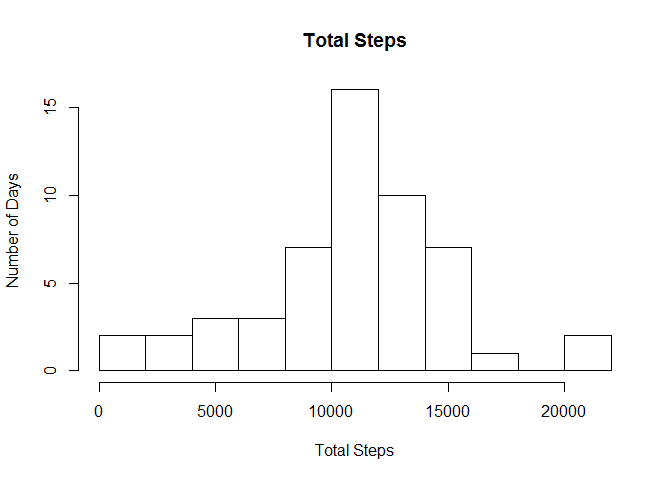
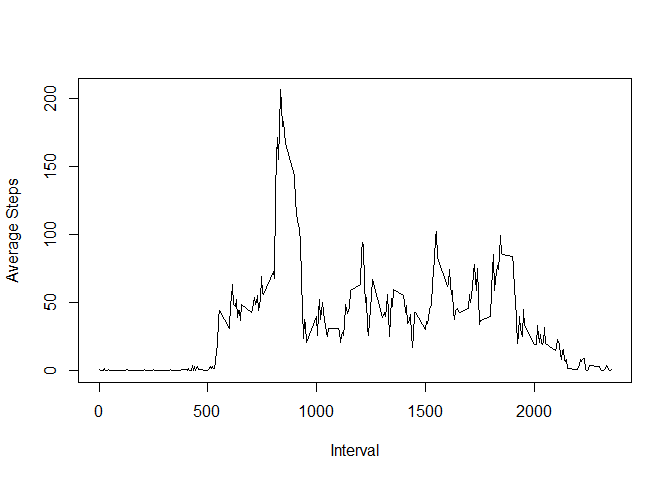
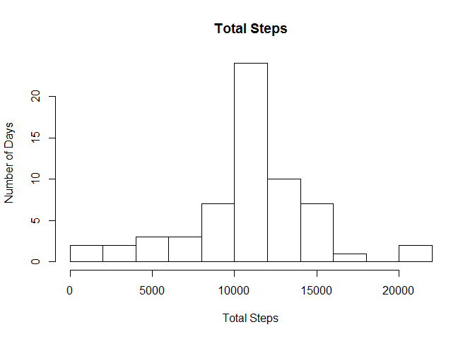
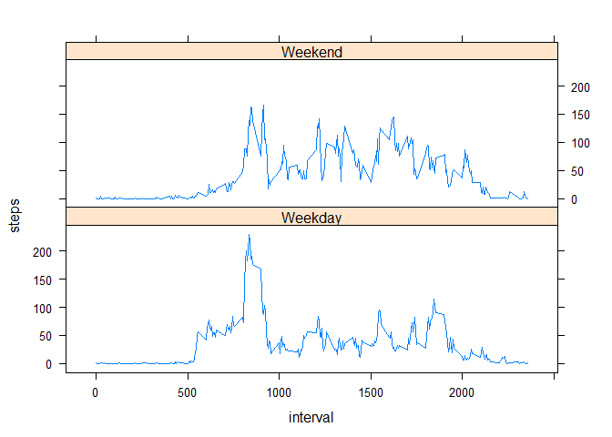

# Reproducible Research: Peer Assessment 1


## Loading and preprocessing the data
Set working directory and import necessary packages:

```r
setwd("C:/Users/nicholas.anderson/Documents/R/ReproducibleResearch/RepData_PeerAssessment1")
library(lattice)
```

```
## Warning: package 'lattice' was built under R version 3.2.2
```

```r
library(dplyr)
```

```
## Warning: package 'dplyr' was built under R version 3.2.2
```

```
## 
## Attaching package: 'dplyr'
## 
## The following objects are masked from 'package:stats':
## 
##     filter, lag
## 
## The following objects are masked from 'package:base':
## 
##     intersect, setdiff, setequal, union
```

```r
library(proto)
library(gsubfn)
library(DBI)
library(RSQLite)
library(sqldf)
library(tcltk)
library(stringr)
```

```
## Warning: package 'stringr' was built under R version 3.2.2
```
Read data:

```r
data<-read.csv("activity.csv",stringsAsFactors=FALSE)
data[,"date"]<-as.Date(data[,"date"])
```

## What is mean total number of steps taken per day?

```r
stepsByDay<-sqldf("select date,sum(steps) as 'steps' from data group by date")
hist(stepsByDay[,2],xlab="Total Steps",ylab="Number of Days",main="Total Steps",breaks=10)
```

 

What is the mean number of steps per day?

```r
sqldf("select avg(steps) as 'Mean Number of Steps' from stepsByDay" )
```

```
##   Mean Number of Steps
## 1             10766.19
```
What is the median number of steps per day?

```r
sqldf("select median(steps) as 'Median Number of Steps' from stepsByDay")
```

```
##   Median Number of Steps
## 1                  10765
```

## What is the average daily activity pattern?

#### What does the average daily activity pattern look like?

```r
dataByInterval<-sqldf("select interval,avg(steps) as 'steps' from data group by interval")
plot(dataByInterval[,1], dataByInterval[,2],type="l",xlab="Interval",ylab="Average Steps")
```

 

####What interval has the highest average activity over all days?

```r
maxSteps<-sqldf("select interval,max(steps) as 'Peak Average Steps' from dataByInterval")
print(maxSteps[1])
```

```
##   interval
## 1      835
```
## Imputing missing values
How many missing values are there? 

```r
sum(is.na(data[,"steps"]))
```

```
## [1] 2304
```
To account for missing data, we will replace NAs with the mean number of steps for that interval. 
Since we have already found the average per interval above, we can re-use dataByInterval. We'll start by creating
a new dataset called "newData".

```r
newData<-data
for(i in 1:nrow(newData)){
if(is.na(newData[i,"steps"])){
  
  newData[i,"steps"]<-filter(dataByInterval,interval==newData[i,"interval"])[2]}
}
```
Let's see how filling in the NAs affected the steps per day overall, and the mean and median number of steps per day.

```r
newStepsByDay<-sqldf("select date,sum(steps) as 'steps' from newData group by date")
hist(newStepsByDay[,2],xlab="Total Steps",ylab="Number of Days",main="Total Steps",breaks=10)
```

 

What is the mean number of steps per day?

```r
sqldf("select avg(steps) as 'Mean Number of Steps' from newStepsByDay" )
```

```
##   Mean Number of Steps
## 1             10749.77
```
What is the median number of steps per day?

```r
sqldf("select median(steps) as 'Median Number of Steps' from newStepsByDay")
```

```
##   Median Number of Steps
## 1                  10641
```
It appears our histogram of total steps per day did not change much, however, we see the mean number 
of steps per day drop slightly, and the median number drop slightly more significantly.

## Are there differences in activity patterns between weekdays and weekends?
First, we will introduce the new column, "Weekday"

```r
for(i in 1:nrow(newData)){
if(weekdays(newData[i,"date"])=="Saturday"|weekdays(newData[i,"date"])=="Sunday"){newData[i,"Weekday"]<-"Weekend"}else{newData[i,"Weekday"]<-"Weekday"}
}
```
Next, we will summarise the data, and graph that data by the Weekday variable

```r
newData<-group_by(newData,Weekday,interval)
newData<-summarise(newData,steps=mean(steps))
xyplot(steps~interval|Weekday,data=newData,type="l",layout=c(1,2))
```

 
